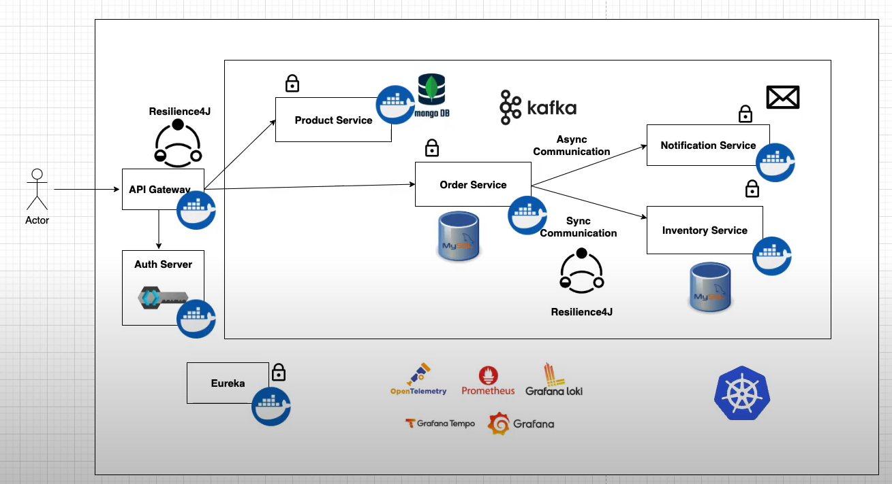

# 🧩 Microservices E-Commerce Platform

This project is a **Microservices-based E-Commerce System** built with **Spring Boot**, **Docker**, and **Kafka**.  
It demonstrates a robust architecture featuring **synchronous and asynchronous communication**, **Resilience4J fault tolerance**, **centralized authentication**, and **monitoring using Grafana and Prometheus**.

---

## 🏗️ Architecture Overview



### 🧠 Key Highlights

- **API Gateway** – Single entry point for all clients with route-based forwarding.
- **Auth Server** – Provides secure authentication and authorization.
- **Product Service** – Manages products using MongoDB.
- **Order Service** – Handles orders and interacts with Inventory Service and Kafka.
- **Inventory Service** – Tracks stock levels using MySQL.
- **Notification Service** – Listens to Kafka events for order confirmations.
- **Eureka Server** – Service discovery and registration.
- **Resilience4J** – Ensures fault tolerance and circuit breaking.
- **Kafka** – Enables asynchronous communication between microservices.
- **Prometheus + Grafana** – Used for metrics collection, visualization, and alerting.

---

## ⚙️ Technologies Used

| Category                         | Tools / Frameworks                                             |
| -------------------------------- | -------------------------------------------------------------- |
| **Backend Framework**            | Spring Boot (WebFlux, WebMVC, Data JPA, Security, Validation)  |
| **Database**                     | MySQL, MongoDB                                                 |
| **Message Broker**               | Apache Kafka, Confluent Schema Registry (Avro-based messaging) |
| **Resilience & Fault Tolerance** | Resilience4J                                                   |
| **API Management**               | Spring Cloud Gateway                                           |
| **Service Discovery**            | Netflix Eureka                                                 |
| **Authentication**               | Keycloak (Auth Server)                                         |
| **Monitoring**                   | Prometheus, Grafana, Loki, Tempo                               |
| **Containerization**             | Docker, Docker Compose                                         |
| **Orchestration**                | Kubernetes                                                     |
| **Build Tool**                   | Maven                                                          |
| **Language**                     | Java 17+                                                       |

---

## 🧩 Microservices Structure

├── api-gateway
├── auth-server
├── eureka-server
├── product-service
│ └── MongoDB
├── order-service
│ └── MySQL
├── inventory-service
│ └── MySQL
├── notification-service
└── kafka

---

## 🔁 Communication Flow

### 🔸 Synchronous Communication

- **Order Service ↔ Inventory Service** via REST using `RestClient`.
- Handled by `Resilience4J` for retries, fallbacks, and circuit breaking.

### 🔸 Asynchronous Communication

- **Order Service → Notification Service** via **Kafka topic `order-placed`**.
- Uses **Avro serialization** for schema-based messaging.

---

## 🚀 How to Run the Project

### 🧱 Prerequisites

Make sure you have the following installed:

- Docker & Docker Compose
- Java 17+
- Maven 3.9+
- Kafka (via Docker)
- Keycloak (for Auth)
- MySQL & MongoDB (in containers)

---

### 🧩 Step 1: Clone the Repository

```bash
git clone https://github.com/your-username/microservices-ecommerce.git
cd microservices-ecommerce
```

### 🧩 Step 2: Build and Run Docker Compose

```bash
mvn clean install

docker compose build
docker compose up -d
```

This will start:

- `api-gateway`
- `eureka-server`
- `auth-server`
- `product-service`
- `order-service`
- `inventory-service`
- `notification-service`
- `kafka`

---

### 🧩 Step 3: Access Microservices

| Service                    | URL                     | Description                  |
| -------------------------- | ----------------------- | ---------------------------- |
| **Eureka Dashboard**       | `http://localhost:8761` | Service Discovery            |
| **API Gateway**            | `http://localhost:8080` | Entry point for all requests |
| **Product Service**        | `http://localhost:8081` | Product APIs                 |
| **Order Service**          | `http://localhost:8082` | Order APIs                   |
| **Inventory Service**      | `http://localhost:8083` | Inventory APIs               |
| **Notification Service**   | `http://localhost:8084` | Kafka Event Consumer         |
| **Keycloak Admin Console** | `http://localhost:8085` | Authentication Management    |
| **Grafana Dashboard**      | `http://localhost:3000` | Monitoring UI                |
| **Prometheus**             | `http://localhost:9090` | Metrics collection           |

---

### 🧩 step 4: Order Placement Flow

- `User → API Gateway → Order Service`
- `Order Service → Inventory Service`
- `Order Service (async event) → Kafka → Notification Service`
- `Notification Service sends confirmation email or log`
- `Resilience4J ensures fallback if Inventory Service fails`

---

### 🧩 Step 5: Sample API Endpoints

Create Product:

```bash
POST /api/product
{
  "name": "iPhone 16",
  "description": "Flagship phone",
  "price": 1299.99,
  "skuCode": "IPH16-001"
}
```

Place order:

```bash
POST /api/order
{
  "skuCode": "IPH16-001",
  "price": 1299.99,
  "quantity": 2,
  "userDetails": {
    "firstName": "Ojas",
    "lastName": "Tyagi",
    "email": "ojas@example.com"
}
}
```

### 🧩 Step 6: Key Learning Outcomes

Throughout this project, we implemented and learned:

- `Building and integrating Spring Boot Microservices`
- `Managing synchronous (REST) and asynchronous (Kafka) communication`
- `Using Avro and Schema Registry for typed event-driven architecture`
- `Implementing Resilience4J for fault tolerance and circuit breaking`
- `Setting up Service Discovery (Eureka) and API Gateway`
- `Using Keycloak for authentication`
- `Deploying services using Docker Compose and preparing for Kubernetes`
- `Setting up centralized monitoring using Grafana, Prometheus, Loki, and Tempo`

---

### License

This project is licensed under the MIT License - see the LICENSE file for details.
